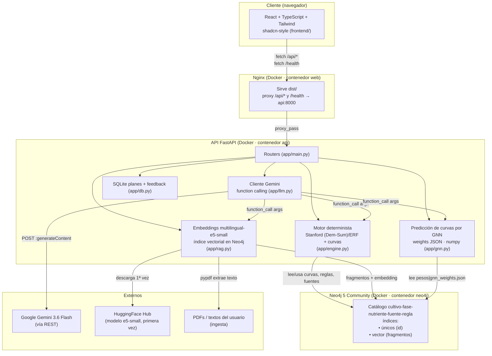
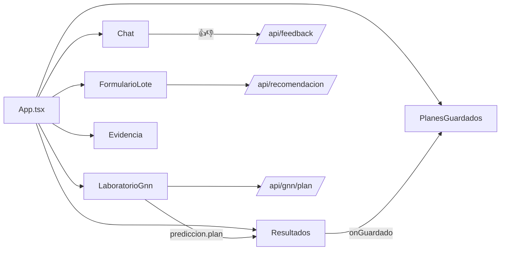
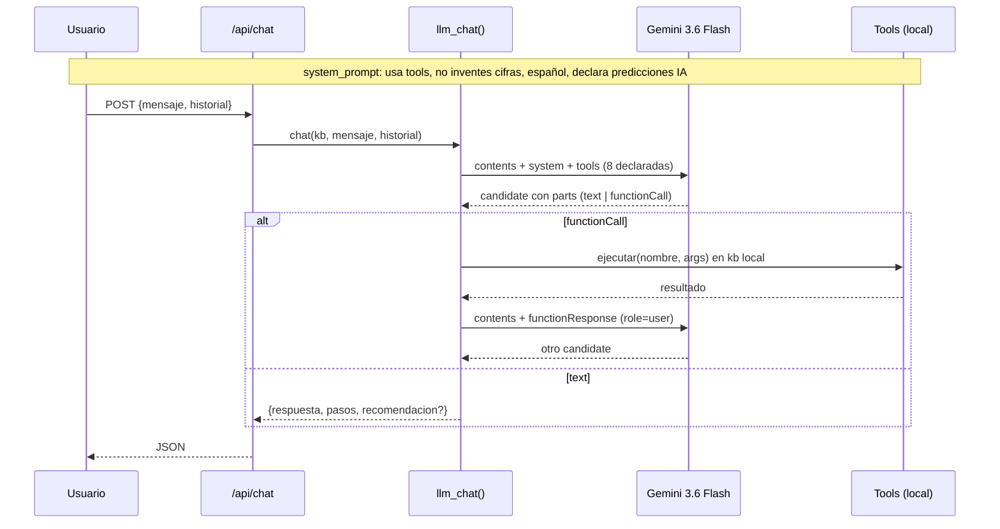
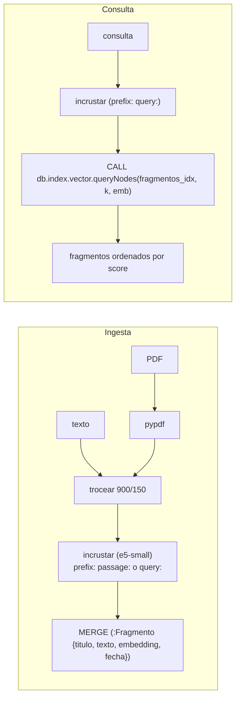
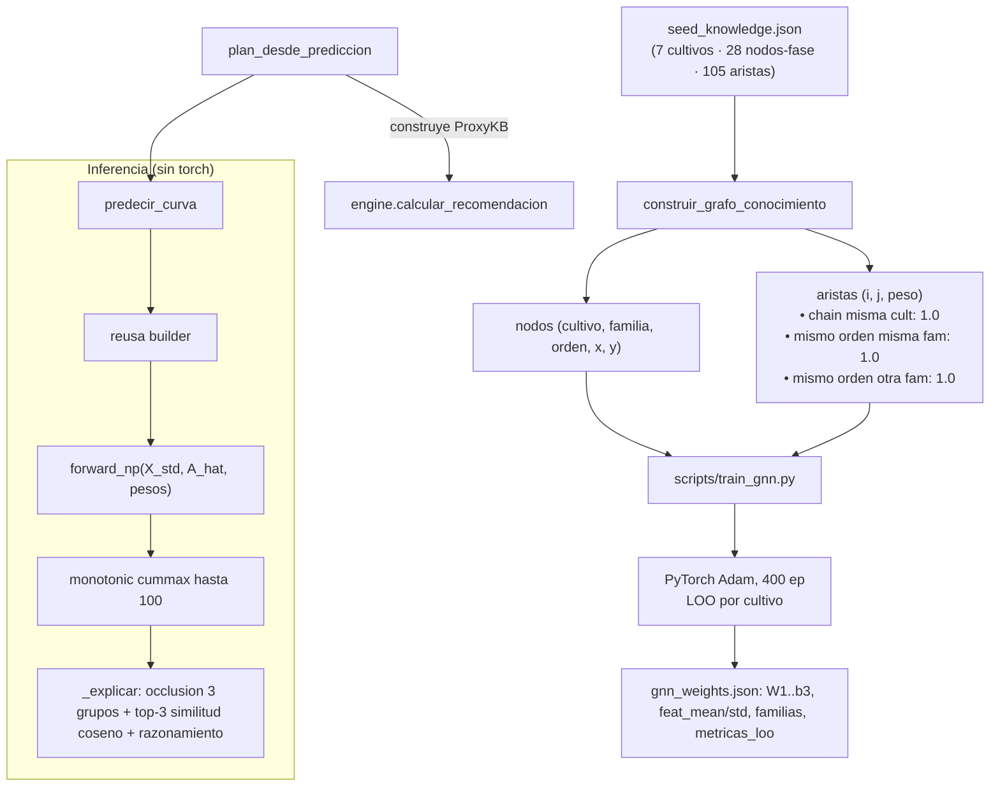
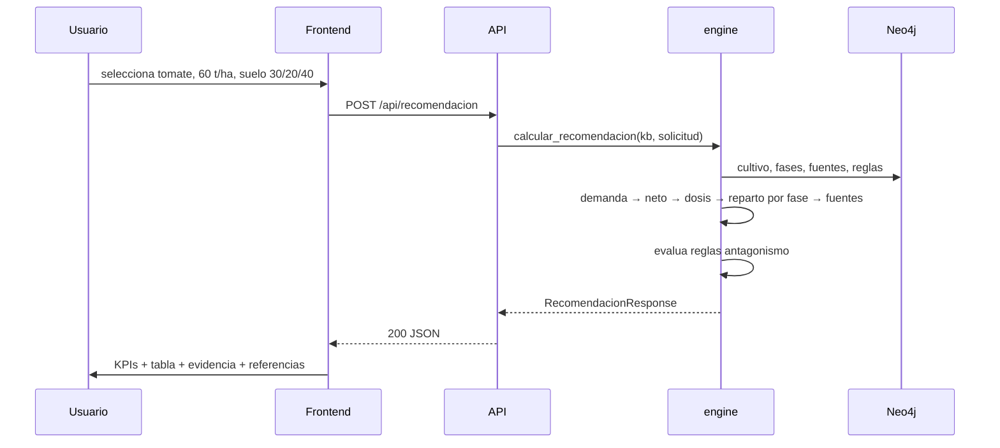
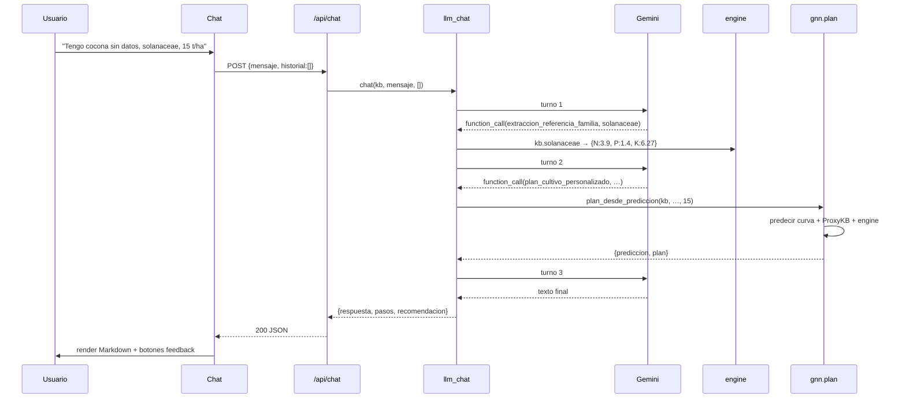
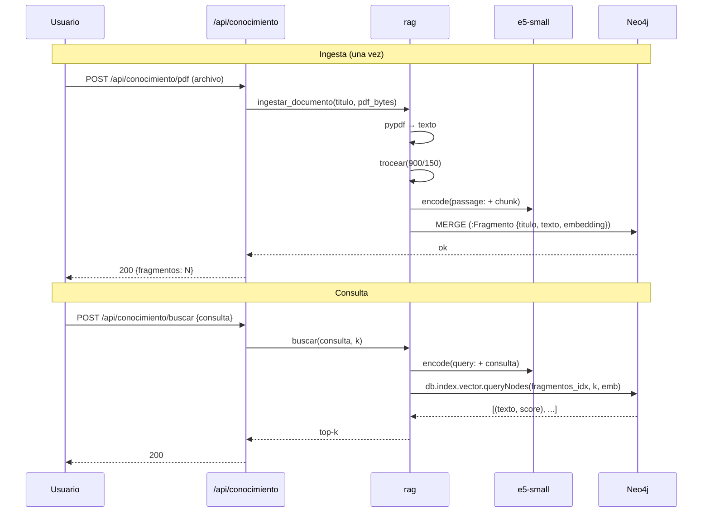
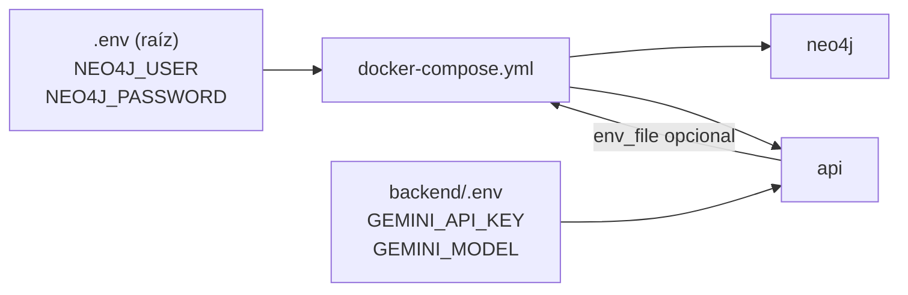
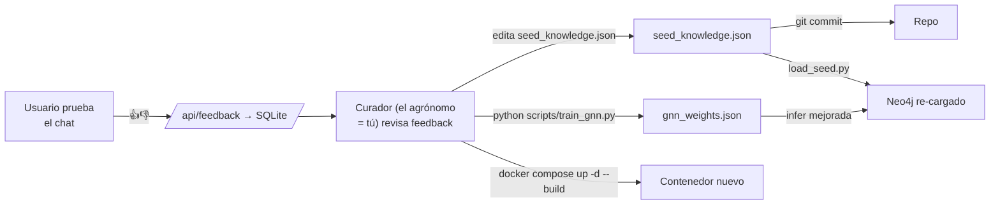

# FertiCalc — Arquitectura del agente

Documento vivo. Cuando un componente cambie, actualiza aquí su diagrama.

## Vista general (capa a capa)



## Componentes en detalle

### 1. Frontend (browser)

`frontend/src/` con TypeScript estricto. Sin estado global (todo useState en `App.tsx`).

| Archivo | Rol |
|---|---|
| `App.tsx` | Orquestador: catálogo, parámetros, resultado, chat, laboratorio, planes. Esqueletos con skeletons. Banner de error global. |
| `components/FormularioLote.tsx` | Formulario principal para cultivos del catálogo: cultivo + rendimiento + suelo + ERF + fase desde. |
| `components/Resultados.tsx` | Render de un `RecomendacionResponse`: KPIs, advertencias, tabla por fase con barras N/P/K y chips de fuentes, evidencia y referencias en `<details>`. |
| `components/Evidencia.tsx` | Pasos de cálculo + lista de referencias bibliográficas. |
| `components/PlanesGuardados.tsx` | Lista de planes en SQLite (CRUD). |
| `components/Chat.tsx` | Chat LLM con `Markdown.tsx` (react-markdown + remark-gfm) y feedback 👍/👎 → `/api/feedback`. |
| `components/LaboratorioGnn.tsx` | Flujo para cultivos SIN curva: familia primero → auto-sugerir extracción → generar plan. Reusa `Resultados` con el plan devuelto por `/api/gnn/plan`. |
| `components/Markdown.tsx` | Render GFM con mappers a tokens del sistema. |
| `lib/api.ts` | Único punto de fetch: tipos, wrappers tipados, endpoint. |
| `lib/utils.ts` | `cx`, `fmtNum`, `fmtFecha`, `NUTRIENTES`. |
| `components/ui/*` | Primitivos estilo shadcn: button, input, label, card, badge, skeleton, alert. |



### 2. Nginx (contenedor `web`)

`frontend/Dockerfile` produce un build estático con Vite y lo sirve nginx. La conf (`frontend/nginx.conf`) hace:

- `location /` → `try_files $uri /index.html` (SPA fallback)
- `location /api/`, `location /health` → `proxy_pass http://api:8000` (red Docker interna)

Puertos: `3000:80`.

### 3. API FastAPI (contenedor `api`)

`backend/app/main.py` define los routers; la lógica vive en módulos.

| Router / endpoint | Módulo que ejecuta | Escribe en |
|---|---|---|
| `GET /health` | `graph.get_knowledge` | – |
| `GET /api/cultivos`, `/api/cultivos/{id}` | graph | Neo4j (consulta) |
| `POST /api/recomendacion` | **engine** | Neo4j (consulta) |
| `GET /api/cadena/{id}` | graph | Neo4j |
| `GET/POST/DELETE /api/planes[/{id}]` | db (SQLite) | `backend/data/ferticalc.db` (volumen) |
| `POST /api/chat` | **llm** → motor | – |
| `POST /api/feedback`, `GET /api/feedback` | db | SQLite |
| `POST /api/conocimiento/texto|pdf` | **rag** | Neo4j (índices + nodos Fragmento) |
| `POST /api/conocimiento/buscar` | rag | Neo4j (vector index) |
| `GET /api/gnn/estado` | gnn (carga pesos) | – |
| `POST /api/gnn/predecir` | **gnn** | – |
| `GET /api/gnn/familia/{familia}` | gnn | – |
| `POST /api/gnn/plan` | **gnn** → engine (con `_ProxyKB`) | – |

#### 3.1 Motor determinista (`engine.py`)

```mermaid
flowchart LR
    S[SolicitudRecomendacion] -->|extrae| P[Por nutriente N,P,K]
    P -->|demanda = ext * rend| D[demanda_total]
    P -->|neto = max(0, demanda - suelo)| N[requerimiento_neto]
    N -->|dosis = neto / ERF| Z[dosis_total]
    Z -->|reparte por fase segun curva_pct| F[RecomendacionFase x4]
    F -->|prioridad cultivo + dominante| S2[Fuentes sugeridas]
    S2 -->|carga reglas| R[ReglasAntagonismo]
    R -->|evalua ratio/umbral| AV[Advertencias]
    F --> E[Evidencia con fórmula y cita]
```

Salida: `RecomendacionResponse` (Pydantic v2, ver `schemas.py`) que la API serializa directo a JSON.

#### 3.2 Cliente LLM (`llm.py`)



Tools (8):
- `listar_cultivos`, `obtener_cultivo`, `listar_fuentes` — `graph`
- `calcular_recomendacion` — `engine`
- `buscar_literatura` — `rag.buscar`
- `predecir_curva_gnn` — `gnn.predecir_curva` (devuelve explicación)
- `plan_cultivo_personalizado` — `gnn.plan_desde_prediccion` (incluye explicación)
- `extraccion_referencia_familia` — `gnn.resumen_familia`

Guardrails: `MAX_ITERACIONES=4`, si excede devuelve mensaje "alcanza limite". Prompts obligan a no inventar cifras y a etiquetar predicciones como experimentales.

#### 3.3 RAG (`rag.py`)



Modelo: `intfloat/multilingual-e5-small` (384 dim). Persistido en `hf_cache` (volumen Docker). `get_rag()` decide Neo4j vs JSON (`backend/data/rag_fragments.json`) según disponibilidad del driver.

#### 3.4 GNN (`gnn.py`)



Arquitectura del modelo: GCN 2×16 sigmoide. Features por nodo: `[orden/4, bbch_ini/99, bbch_fin/99, log1p(N), log1p(P), log1p(K)]` + **one-hot familia**. Pesos exportados a JSON → inferencia 100% numpy. Resultado: MAE LOO global **±5.9 pts**.

Explicabilidad: oclusión (ocultar grupo de features → medir delta), similitud coseno vs catálogo (top-3 con %), razonamiento textual generado.

`plan_desde_prediccion` envuelve `engine.calcular_recomendacion` con `_ProxyKB` (un kb en memoria que reemplaza `cultivo()` por un cultivo sintético construido a partir de la curva predicha), reusando el motor sin duplicar lógica.

### 4. Neo4j (contenedor `neo4j`)

Imagen: `neo4j:5-community`. Volumen `neo4j_data` persiste entre reinicios. Password vía `.env` raíz.

Esquema (constraints únicos en `id`):

```mermaid
graph LR
    C[Cultivo<br/>nombre, unidad, extraccion_N/P/K, preferencia_fuentes, notas]
    F[FaseFenologica<br/>nombre, bbch_ini, bbch_fin]
    N[Nutriente<br/>N | P | K]
    R[Referencia<br/>autores, anio, titulo, fuente]
    S[FuenteFertilizante<br/>nombre, tipo]
    G[ReglaAntagonismo<br/>tipo, base, nutriente_ref, factor, umbral, mensaje]
    FR[Fragmento<br/>titulo, texto, embedding(384), fecha]

    C -->|TIENE_FASE| F
    F -->|EXTRAE {pct, fuente_ref}| N
    C -->|DOCUMENTADO_POR| R
    S -->|APORTA {pct}| N
    G -->|DOCUMENTADO_POR| R
    FR -.->|vector index| FR
```

Carga inicial: `docker compose exec api python scripts/load_seed.py` (idempotente con MERGE).

## Flujos completos

### A) Recomendación para cultivo del catálogo



### B) Chat LLM con motor y GNN



### C) RAG literario



## Despliegue y variables de entorno



`backend/.env` y `.env` raíz están en `.gitignore`. En el contenedor `api` se inyectan ambos:
- root `.env` vía interpolación `${VAR}` en `docker-compose.yml`
- `backend/.env` vía `env_file: - path: ./backend/.env, required: false`

## Ciclo de mejora continua



## Pruebas

46 tests en `backend/tests/`. Corren con:

```bash
cd backend
pip install -r requirements-dev.txt
python -m pytest tests -q
```

Cubren: fórmula de Stanford exacta (300/240/540 zero-soil, 250/160/460 con suelo 30/20/40), conservación por fase en los 7 cultivos, antagonismos, dominancia de fuentes, trazabilidad de referencias, GNN monotónico y sensible a familia, plan IA con advertencia, CRUD de planes y feedback, chat 503 sin `GEMINI_API_KEY`, regresiones específicas de los dos bugs encontrados (campo `referencias` descartado y `familia` ignorado).
